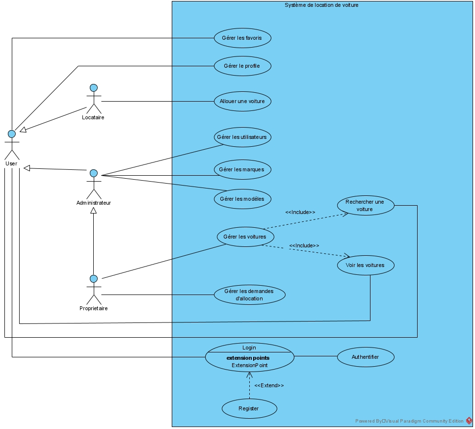
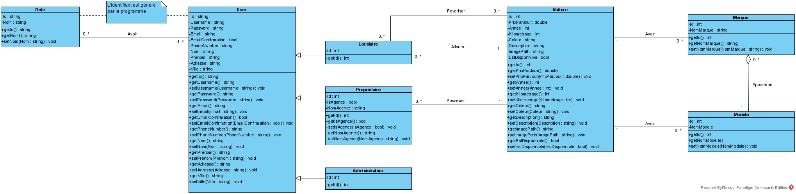
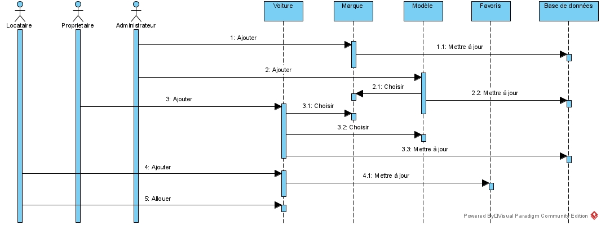

## AutoPro

Car Rental Website built using ASP .NET, MVC Architecture and Entity Framework

## Software Design 

Our application is based on Oriented Object Programming so for the software design we used UML o write a system model, covering conceptual ideas...

## Application diagrams :
Use Case diagram

Class diagram

Sequence diagram

## Database Architecture :

